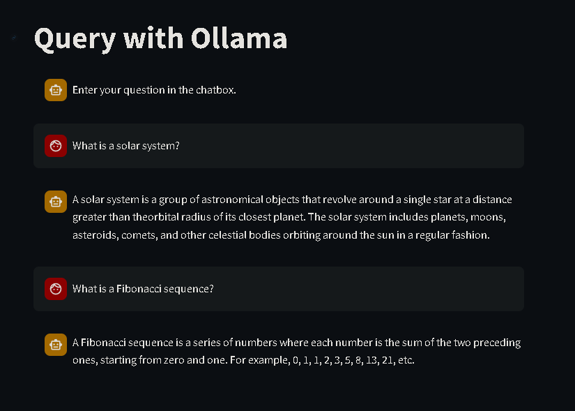

# Streamlit Ollama Chat

This project utilizes Ollama, an open-source library, to query the open-source LLMs (Llama Language Models) using Streamlit.

## Installation

1. Clone the repository:

    ```shell
    git clone https://github.com/nebulaa/Streamlit_Ollama_Chat.git
    ```

2. Navigate to the project directory:

    ```shell
    cd Streamlit_Ollama_Chat
    ```

3. Install the required dependencies:

    ```shell
    pip install -r requirements.txt
    ```

## Usage

1. Download and run that Ollama application. Ensure that Ollama is running at `http://localhost:11434/`.

    ```shell
    ollama pull llama2-uncensored
    ```

2. Run the Streamlit app:

    ```shell
    streamlit run app.py
    ```

3. Open your web browser and visit `http://localhost:8501` to access the Ollama chat interface.

4. Start interacting with the LLM by entering your queries and receiving responses in real-time.

    